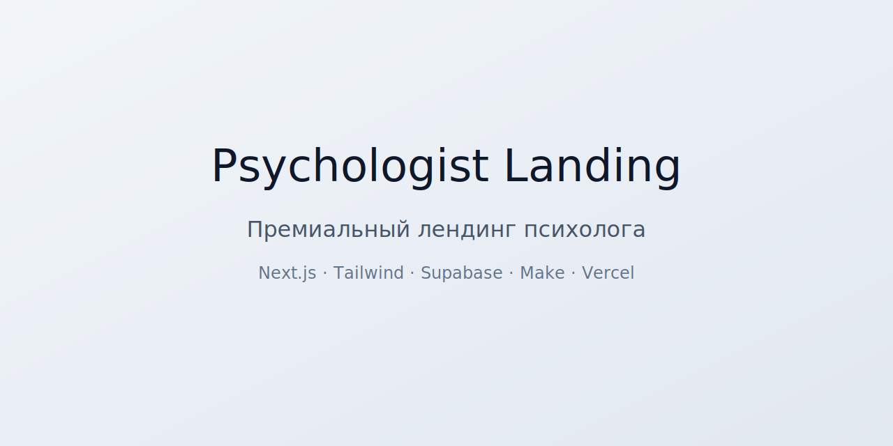

  

🧘‍♀️ Psychologist Landing — Премиальный лендинг психолога
Современный, минималистичный и премиальный лендинг для частного психолога.
Сайт включает рабочую форму записи, интеграцию с Supabase и Make, автоматизацию заявок и адаптивный дизайн.

Проект создан на Next.js 14 / App Router, с использованием Tailwind CSS, Supabase, Make (Integromat) и полностью готов к продакшен‑деплою на Vercel.

<h5>✨ Основные возможности
Премиальный дизайн с мягкими градиентами и акцентом на спокойствие</h5>

Адаптивная верстка (мобильные, планшеты, десктопы)

Блоки:

Hero‑блок

Обо мне (с фото)

С чем я работаю

Стоимость консультации

Форма записи

Рабочая форма записи с отправкой данных в Supabase

Автоматизация заявок через Make (Telegram / Email / WhatsApp)

SSR + Client Components

Готов к SEO‑оптимизации

Готов к подключению  

<h3>🛠️ Технологии</h3>
Next.js 14 (App Router)

React 18

Tailwind CSS

Supabase (PostgreSQL + API)

Make (Webhook + автоматизация)

Vercel (хостинг)

📦 Установка и запуск
bash
git clone https://github.com/USERNAME/psychologist-landing.git
cd psychologist-landing
npm install
npm run dev
Сайт будет доступен по адресу:

Код
http://localhost:3000
🔗 Интеграции
Supabase
Используется для хранения заявок:

Таблица appointments

API‑роут /api/appointments

Триггер PostgreSQL → Make Webhook

Make
Используется для автоматизации:

Принимает webhook от Supabase

Отправляет уведомления психологу (Telegram / Email / WhatsApp)

Логирует заявки

🧩 Структура проекта
Код
app/
  page.tsx
  api/
    appointments/
      route.ts
public/
  psychologist-photo.jpg
styles/
  globals.css
  
🚀 Деплой на Vercel
Залить проект на GitHub

В Vercel → New Project

Выбрать репозиторий

Deploy

## 🎥 Demo Video

📄 Лицензия
MIT — свободно используйте, модифицируйте и развивайте проект.

👤 Автор
Rick — разработчик, дизайнер и создатель премиальных цифровых продуктов.

